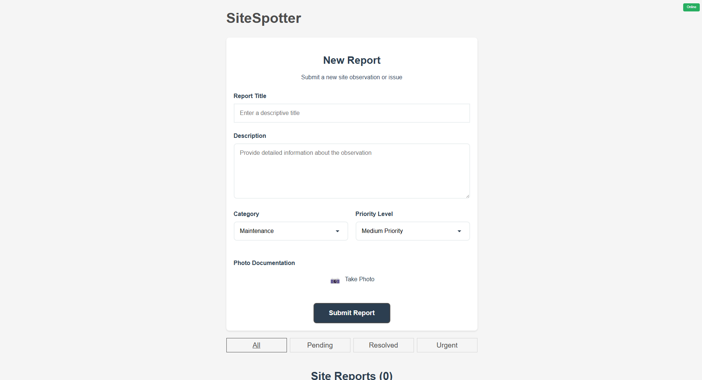

# SiteSpotter - Field Reporting PWA

SiteSpotter is a Progressive Web Application (PWA) designed for field reporting, allowing users to document site observations, maintenance issues, hazards, and other environmental concerns with support for offline operation.



## Features

- **Create detailed reports** with titles, descriptions, categories, and priority levels
- **Edit existing reports** to update information as situations change
- **Capture photos** directly within the application
- **Record GPS coordinates** automatically
- **Work offline** with full data synchronization when back online
- **Filter reports** by status and priority
- **Installable PWA** with home screen icon

## Demo

Try the live demo at: [https://geo-app-iota.vercel.app/](https://geo-app-iota.vercel.app/)

## Installation Options

### Method 1: Installing as a PWA (Recommended)

1. Visit the SiteSpotter website in Chrome, Edge, or Safari: [https://geo-app-iota.vercel.app/](https://geo-app-iota.vercel.app/)
2. Wait for the page to fully load
3. Look for the install prompt in your browser:
   - Chrome/Edge: Click the "Install" button in the address bar
   - Safari (iOS): Tap the share button, then "Add to Home Screen"
4. Follow the on-screen instructions
5. The app will appear on your home screen as "SiteSpotter"

### Method 2: Running Locally

#### Prerequisites
- [Node.js](https://nodejs.org/) (v16 or newer)
- npm or yarn

#### Setup
1. Clone the repository
   ```bash
   git clone https://github.com/NotInPut/geo-app.git
   ```
2. Navigate to the project directory
   ```bash
   cd geo-app
   ```
3. Install dependencies
   ```bash
   npm install
   # or
   yarn
   ```
4. Start the development server
   ```bash
   npm run dev
   # or
   yarn dev
   ```
5. Open your browser and visit `http://localhost:5173`

## Building for Production

```bash
npm run build
# or
yarn build
```

The build output will be in the dist directory.

## Usage Guide

### Creating a Report
1. Open the SiteSpotter application
2. Fill out the report form:
   - Title and description
   - Select a category (Maintenance, Wildlife, Hazard, or Vandalism)
   - Set priority level
3. To add a photo, click "Take Photo" and use your device camera
4. Submit the report

### Managing Reports
- Use the filter buttons to view specific types of reports (All, Pending, Resolved, Urgent)
- Click on a report's "Mark as Resolved" button to change its status
- Delete reports with the "Delete" button
- View full-size images by clicking on them

### Editing Reports
1. Locate the report you want to modify
2. Click the "Edit" button on the report card
3. The report will enter edit mode, allowing you to change:
   - Title and description
   - Category (Maintenance, Wildlife, Hazard, or Vandalism)
   - Priority level (Low, Medium, High)
4. Make your desired changes
5. Click "Save" to update the report, or "Cancel" to discard changes

### Offline Usage
SiteSpotter works fully offline:
- The app will indicate offline status
- Reports created offline will be synchronized automatically when connection is restored
- All data is stored locally on your device
- Editing functionality works offline as well

## Technology Stack

- React 19
- Vite 6
- PWA features with service workers
- LocalStorage for offline data persistence
- Camera and Geolocation APIs

## Privacy & Data Storage

- All data is stored locally on your device
- Photos are converted to data URLs and stored in LocalStorage
- GPS coordinates are only captured when you create a report
- No analytics or tracking scripts are included

## License

This project is licensed under the MIT License - see the LICENSE file for details.

## Contact

Project Link: [https://github.com/NotInPut/geo-app](https://github.com/NotInPut/geo-app)
